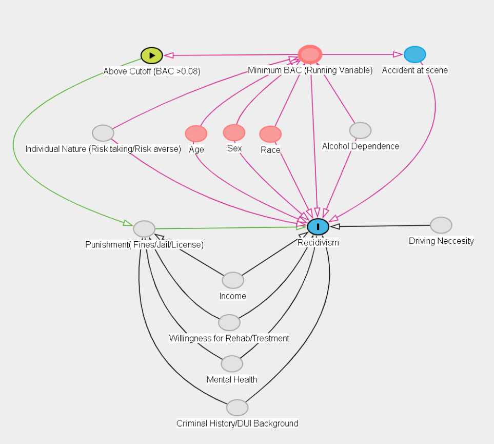

## Introduction:

The goal of this project is to answer the following research question:

**Do harsher punishments for drunk driving reduce the probability of future drunk-driving offenses?**

In Washington State, drivers whose blood alcohol concentration (BAC) is 0.08 or higher face stricter legal penalties than those just below this threshold. Because this rule creates a sharp cutoff, drivers with BAC levels just below and just above 0.08 are likely to be very similar, except for the punishment they receive.

This project uses that cutoff to examine whether harsher penalties have a deterrent effect on future drunk driving. If stricter punishment discourages risky behavior, drivers just above the 0.08 threshold should be less likely to commit another offense than drivers just below it.

However, simply comparing drivers with different BAC levels could be misleading, since individuals with very high BAC levels may differ in many ways from those with lower levels. To address this issue, the analysis focuses on drivers close to the legal cutoff and applies a regression discontinuity design to estimate the causal effect of harsher penalties on recidivism.

The next section presents the causal framework and identification strategy used to estimate this effect.

## Causal Diagram

{fig-align="center"}

The causal diagram shows how blood alcohol concentration (BAC) affects both punishment severity and future drunk-driving recidivism. In Washington State, drivers with a BAC of 0.08 or higher face harsher legal penalties, and the running variable in this analysis is the minimum BAC from the two tests (min_BAC) centered at the cutoff.

The main relationship of interest is

BAC → Harsher Punishment → Recidivism

Some observable characteristics such as age, gender, race, accident involvement, and year effects may influence both BAC and the likelihood of reoffending.

To account for these factors, the empirical analysis controls for observable characteristics and uses a regression discontinuity design, comparing drivers just below and just above the BAC cutoff. Because drivers near the threshold are expected to be similar in most respects, this approach helps isolate the causal effect of harsher punishment on recidivism.

## Data Overview And Cleaning

```{r}
library(tidyverse)
library(fixest)
library(ggplot2)
library(rddensity)
library(vtable)
library(rdrobust)
```

```{r}
#Reading dataset
load("../raw_data/DWI_Data.rdata")

# Basic checks 
str(dwi)
names(dwi)
summary(dwi)
rows_with_na <- which(!complete.cases(dwi)) #Identify rows with any missing values
rows_with_na #return 0, means no missing values in dataset
```

The dataset used in this analysis contains 214,558 DUI arrests in Washington State between 1999 and 2007. Each observation represents a single DUI incident and includes information on the driver, blood alcohol concentration (BAC), and whether the driver later committed another offense.

As a first step, we inspected the dataset using structure and summary statistics to understand the variables and their distributions. We also checked for missing values using and no missing observations were found. This suggests the dataset is complete and suitable for analysis.

A few patterns from the summary statistics are worth noting. The variables Alcohol1 and Alcohol2 represent the raw alcohol readings before conversion to BAC rates. Their means and medians are very close, suggesting the distribution is relatively symmetric. The dataset is also heavily male: the variable male has a mean of about 0.79, meaning roughly 79% of offenders are male, while white has a mean of about 0.86.

The outcome variable recidivism has a mean of 0.118, indicating that about 11.8% of drivers commit another DUI offense after the initial incident. The variable acc, which indicates whether the stop involved an accident, has a mean of about 0.15, suggesting accidents occur in roughly 15% of cases.

In terms of demographics, the average age in the dataset is about 35 years, with most offenders concentrated in their early to mid-30s. The BAC variables bac1 and bac2 have similar distributions and reach maximum values around 0.44, indicating that some drivers in the dataset had extremely high alcohol levels.

Overall, the dataset appears clean and provides the key variables needed to study the relationship between BAC levels, punishment at the legal threshold, and future DUI recidivism.

The next step is to construct the running variable and treatment indicator based on the threshold, which form the basis of the regression discontinuity design used in this study.

### Feature Engineering

```{r}
#Feature engineering
c <- 0.08  #cutoff (legal limit)
dwi <- dwi %>%
  mutate(
    min_BAC = pmin(bac1, bac2, na.rm = TRUE),
    diff_BAC = bac2 - bac1,
    centered_BAC = min_BAC - c,             # centered running variable
    Treated = as.integer(min_BAC >= c)     # above-cutoff indicator = treatment 
  )
```

At each traffic stop, two BAC measurements are recorded through separate tests. In this analysis, we use the minimum of the two BAC readings as the relevant measure. This follows the legal practice in Washington State, where the minimum BAC value determines whether a driver crosses the 0.08 threshold and faces stricter penalties. Using the minimum BAC ensures that our treatment assignment reflects how punishment is determined under the law.

To implement the regression discontinuity design, we construct the running variable by centering the minimum BAC at the legal cutoff. Centering the running variable around zero makes the interpretation more intuitive: values below zero correspond to drivers just below the legal limit, while values above zero correspond to drivers just above it. We also create a treatment indicator, Treated, which equals 1 when the minimum BAC is at or above 0.08 and 0 otherwise.

To check the consistency of the two BAC tests, we examine the difference between the two measurements (bac2 − bac1). If the tests are recorded consistently, this difference should be small and should not show a systematic jump at the 0.08 cutoff. In the data, the differences are generally very small and centered close to zero, suggesting that the two BAC measurements are highly consistent.

Because punishment is determined using the minimum BAC, we rely on this measure as the running variable in the analysis. Using alternatives such as the average of the two BAC readings could misclassify some drivers around the threshold and weaken the regression discontinuity design.

```{r}
# Correlation between 2 tests, should be closer to 1 - to check for measurement discrepancies
cor(dwi$bac1, dwi$bac2, use = "complete.obs")
```

To further assess the consistency of the two BAC measurements, we calculate the correlation between bac1 and bac2. The correlation coefficient is 0.995, which is extremely close to one and indicates that the two tests produce nearly identical readings.

This strong correlation suggests that measurement differences between the two tests are minimal and that BAC values are recorded consistently. While the running variable in this analysis is based on the minimum BAC value, reflecting how punishment is determined under Washington State law, the close agreement between the two tests provides additional reassurance that the BAC measurements are reliable.

## Exploratory Data Analysis

```{r}
# EDA PLOTS 
# Running var: centered_BAC
# Cutoff: 0 (Running Variable is Centered)
# Treatment indicator: Treated (1 if min_BAC >= 0.08 else 0)
# Outcome: recidivism
# Create BAC bins (binned means plots)
# Choose bin width. 0.001 BAC
# The bin width is chosen for visualization purposes only
# to ensure the smoothness of the outcome and covariates around the cutoff
bin_w <- 0.001
h <- 0.05

dwi_binned <- dwi %>%
  mutate(
    bac_bin = floor(centered_BAC / bin_w) * bin_w,
    bac_bin_mid = bac_bin + bin_w/2
  ) %>%
  group_by(bac_bin, bac_bin_mid) %>%
  summarize(
    n = n(),
    mean_recid = mean(recidivism, na.rm = TRUE),
    mean_treat = mean(Treated, na.rm = TRUE),
    mean_male  = mean(male, na.rm = TRUE),
    mean_white = mean(white, na.rm = TRUE),
    mean_age   = mean(aged, na.rm = TRUE),
    mean_acc   = mean(acc, na.rm = TRUE),
    .groups = "drop"
  ) %>%
  filter(n >= 10) # Drop very sparse bins to zoom in in the graph
sum(dwi_binned$n) #number of obs matching with the original dataset
```

To visualize the relationship between BAC and the outcome around the legal cutoff, we construct binned averages of the running variable. BAC values are grouped into bins with a width of 0.001, and within each bin we calculate the average value of recidivism and selected covariates. This bin width is appropriate because BAC is typically measured to three decimal places, allowing us to preserve the variation near the cutoff while still producing stable averages within each bin.

Binning helps reduce noise in the raw data and makes it easier to visually assess potential discontinuities at the threshold, which is a common practice in regression discontinuity analysis.

To further improve the clarity of the graphs, bins containing fewer than 10 observations are removed from the visualization. This step affects only the plotted figures and does not change the underlying dataset used for the regression discontinuity estimation. In total, 37 observations are excluded from the visualization due to sparse bins, while the full sample is retained for the empirical analysis.

The resulting binned data are then used to construct the scatter plots that illustrate the relationship between BAC and recidivism around the legal threshold.

```{r}
#| fig-width: 8
#| fig-height: 5
# Plot Outcome vs Running variable (binned means) with quadratic and linear fit
# to identify the jump and check for curvature for best fit functional form
ggplot(dwi_binned, aes(x = bac_bin_mid, y = mean_recid)) +
  geom_point() +
  geom_vline(xintercept = 0, linetype = "dashed") +
  coord_cartesian(xlim = c(-h, h)) +
  
  # Linear fit 
  geom_smooth(
    aes(group = bac_bin_mid < 0),
    method = "lm",
    formula = y ~ x,
    se = FALSE,
    color = "black",
    linewidth = 1
  ) +
  
  # Quadratic fit
  geom_smooth(
    aes(group = bac_bin_mid < 0),
    method = "lm",
    formula = y ~ poly(x, 2, raw = TRUE),
    se = FALSE,
    color = "red",
    linetype = "dotted",
    linewidth = 1
  ) +
  labs(
    x = "Centered BAC (min_BAC - 0.08)",
    y = "Mean recidivism (within BAC bin)",
    title = "RDD Binned Means: Linear (Black) vs Quadratic (Red Dotted)"
  ) +
  theme_minimal()
```

The binned scatter plot shows the relationship between blood alcohol concentration (BAC) and recidivism around the legal threshold of 0.08. The dashed vertical line marks the cutoff where harsher legal penalties begin.

The scatter plot suggests a drop in recidivism immediately to the right of the cutoff. Drivers with BAC levels just above the legal limit appear to have slightly lower recidivism rates than those just below it. Under the continuity assumption of the regression discontinuity design, individuals on either side of the cutoff are expected to be similar except for treatment status. Therefore, this discontinuity provides visual evidence that harsher punishment may reduce recidivism for drivers near the legal limit.

The linear and quadratic fits on either side of the cutoff are also very similar, suggesting that the pattern is not highly sensitive to the choice of functional form.

## Validity/Assumptions Check

### Placebo Graphs

```{r}
# Plot placebo test graphs
# If these jump at cutoff, RD assumptions are not satisfied
# Male
ggplot(dwi_binned, aes(x = bac_bin_mid, y = mean_male)) +
  geom_point() +
  geom_vline(xintercept = 0, linetype = "dashed") +
  geom_smooth(aes(group = bac_bin_mid < 0), method = "lm", se = FALSE) +
  labs(
    x = "Centered BAC (min_BAC - 0.08)",
    y = "Mean male (within BAC bin)",
    title = "Placebo Check: Male vs Centered BAC"
  ) +
  theme_minimal()
```

```{r}
# White
ggplot(dwi_binned, aes(x = bac_bin_mid, y = mean_white)) +
  geom_point() +
  geom_vline(xintercept = 0, linetype = "dashed") +
  geom_smooth(aes(group = bac_bin_mid < 0), method = "lm", se = FALSE) +
  labs(
    x = "Centered BAC (min_BAC - 0.08)",
    y = "Mean white (within BAC bin)",
    title = "Placebo Check: White vs Centered BAC"
  ) +
  theme_minimal()
```

```{r}
# Age
ggplot(dwi_binned, aes(x = bac_bin_mid, y = mean_age)) +
  geom_point() +
  geom_vline(xintercept = 0, linetype = "dashed") +
  geom_smooth(aes(group = bac_bin_mid < 0), method = "lm", se = FALSE) +
  labs(
    x = "Centered BAC (min_BAC - 0.08)",
    y = "Mean age (within BAC bin)",
    title = "Placebo Check: Age vs Centered BAC"
  ) +
  theme_minimal()
```

```{r}
# Accident indicator
ggplot(dwi_binned, aes(x = bac_bin_mid, y = mean_acc)) +
  geom_point() +
  geom_vline(xintercept = 0, linetype = "dashed") +
  geom_smooth(aes(group = bac_bin_mid < 0), method = "lm", se = FALSE) +
  labs(
    x = "Centered BAC (min_BAC - 0.08)",
    y = "Mean accident (within BAC bin)",
    title = "Placebo Check: Accident vs Centered BAC"
  ) +
  theme_minimal()
```

To assess the validity of the regression discontinuity design, we examine whether predetermined characteristics change at the BAC threshold. The figures plot gender, race, age, and accident involvement against the centered BAC variable, with the dashed vertical line marking the legal threshold where stricter penalties apply.

Across all figures, there is no visible jump at the cutoff of BAC = 0.08. Each variable changes smoothly as BAC increases, and drivers just below the threshold appear very similar to those just above it in terms of observable characteristics. This is an important diagnostic because, in a valid RD design, individuals near the cutoff should be comparable aside from treatment status.

The absence of discontinuities in these variables supports the continuity assumption, suggesting that there is no systematic sorting or manipulation around the threshold. As a result, any discontinuity observed in recidivism is more likely to reflect the causal effect of harsher punishment rather than differences in driver characteristics.

### Density and Manipulation Check

```{r}
#| fig-width: 8
#| fig-height: 5
# Manipulation/Bunching check: Density histogram + formal rddensity test 
h  <- 0.05 #bandwidth
c0 <- 0

dwi_local <- dwi %>%
  filter(abs(centered_BAC) < h)
# Histogram (within bandwidth)
ggplot(dwi_local, aes(x = centered_BAC)) +
  geom_histogram(bins = 80) +
  geom_vline(xintercept = c0, linetype = "dashed") +
  labs(
    x = "Centered BAC (BAC - 0.08)",
    y = "Count",
    title = paste0("Density Check (Histogram within ±", h, "): Centered BAC Around Cutoff")
  ) +
  theme_minimal()
```

To further assess the validity of the regression discontinuity design, we examine whether there is any manipulation of the running variable around the cutoff. In RD designs, individuals should not be able to precisely control their position relative to the threshold. If drivers could manipulate their BAC measurement to fall just below 0.08, we would expect to observe an unusually large number of observations immediately below the cutoff.

The histogram shows the distribution of centered BAC values within a bandwidth of ±0.05 around the threshold. This window focuses on observations close to the cutoff, which are most relevant for identification, while remaining wide enough to produce a smooth and interpretable density pattern.

The distribution appears smooth around the cutoff, with no clear bunching just below or just above the threshold. This suggests that drivers are unlikely to precisely manipulate their BAC values around the legal limit. Overall, the absence of visible bunching supports the assumption that the running variable is not systematically manipulated, strengthening the credibility of the regression discontinuity design.

This graphical evidence is further supported by a formal density test presented in the next section.

```{r}
# Formal density discontinuity test
dens_test <- dwi_local %>%
  pull(centered_BAC) %>%
  rddensity(c = c0)
summary(dens_test)
```

To formally test for manipulation around the cutoff, we use the rddensity test, which examines whether the density of the running variable changes at the threshold. If individuals could manipulate BAC values to fall just below 0.08, we would expect to observe a discontinuity in the density of the running variable around the cutoff.

The test statistic is 1.20, with a p-value of 0.23, meaning we fail to reject the null hypothesis of density continuity at the cutoff. In other words, there is no statistical evidence that drivers are manipulating their BAC values to fall just below the legal limit.

This result is consistent with the histogram presented earlier, which also shows a smooth distribution of BAC around the threshold. Taken together, the graphical evidence and the formal density test support the assumption that the running variable is not manipulated, strengthening the credibility of the regression discontinuity design.

## Modelling and Analysis

```{r}
# Define the RD analysis sample and weights:
# - X is the centered running variable (BAC - 0.08), so the cutoff is at X = 0
# - Treated = 1 if BAC is at/above the legal limit (harsher punishment)
# - Restrict to a local bandwidth |X| < 0.05 to compare drivers near the cutoff
# - Apply triangular kernel weights so observations closest to the cutoff get more weight
# h = bandwidth
h <- 0.05
dwi_rd <- dwi %>%
  mutate(
    X = centered_BAC,
    Treated = as.integer(X >= 0),
    w_tri = pmax(0, 1 - abs(X)/h)
  ) %>%
  filter(abs(X) < h) 
```

To estimate the treatment effect, we implement a local regression discontinuity design around the BAC threshold of 0.08. The running variable is defined as centered BAC (BAC − 0.08) so that the cutoff occurs at zero. Treatment is assigned to drivers whose BAC is at or above the legal limit.

The analysis focuses on observations within a bandwidth of ±0.05 BAC around the cutoff, allowing us to compare drivers who are close to the threshold. We also apply triangular kernel weights, which place greater weight on observations closer to the cutoff during estimation.

### Placebo Models - Assumption Check

```{r}
# PLACEBO (BALANCE) TEST MODELS
# Goal: In a valid RD, people just below and just above the cutoff should look 
# similar in "predetermined" characteristics (things the cutoff cannot cause).
# So we run the SAME RD regression, but we replace the outcome (recidivism) with covariates
# like male/age/race/accident/year. These should NOT jump at the cutoff.
# If they DO jump, it suggests sorting/manipulation or non-comparability around the cutoff,
# which threatens RD validity
#Placebo Test Models
male_placebo <- feols(
  male ~ Treated + X + Treated:X,
  data = dwi_rd,
  vcov = "hetero"
)

aged_placebo <- feols(
  aged ~ Treated + X + Treated:X,
  data = dwi_rd,
  vcov = "hetero"
)

white_placebo <- feols(
  white ~ Treated + X + Treated:X,
  data = dwi_rd,
  vcov = "hetero"
)

acc_placebo <- feols(
  acc ~ Treated + X + Treated:X,
  data = dwi_rd,
  vcov = "hetero"
)

year_placebo <- feols(
  year ~ Treated + X + Treated:X,
  data = dwi_rd,
  vcov = "hetero"
)

etable(male_placebo, aged_placebo, white_placebo, acc_placebo, year_placebo)
```

**Equations**

male_i = 0.7853 + 0.0057Treated_i − 0.1752X_i + 0.2947(Treated_i × X_i) + ε_i

aged_i = 33.92 − 0.1647Treated_i − 66.52X_i + 73.75(Treated_i × X_i) + ε_i

white_i = 0.8478 + 0.0038Treated_i + 0.0552X_i + 0.0488(Treated_i × X_i) + ε_i

acc_i = 0.0825 − 0.0022Treated_i − 1.044X_i + 1.901(Treated_i × X_i) + ε_i

year_i = 2003.4 + 0.0012Treated_i + 2.344X_i − 5.864(Treated_i × X_i) + ε_i

**Interpretation** **of Placebo Models**

We also run placebo regressions using characteristics that should not be affected by the BAC cutoff, including gender, age, race, accident involvement, and year. This complements the graphical evidence presented earlier, where these variables were plotted against the centered BAC and showed no visible discontinuity at the threshold.

If the design is valid, these characteristics should not change abruptly at the cutoff, since the BAC threshold cannot affect a person’s gender, age, race, or whether an accident already occurred. Consistent with the earlier graphs, the regression results show that the treatment coefficient is small and statistically insignificant across all placebo models, indicating no meaningful jump at the threshold.

Together, the graphical and regression-based placebo checks suggest that drivers just below and just above the BAC limit are similar in their observable characteristics, supporting the continuity assumption required for the regression discontinuity design.

### Model 1 - Baseline RD Model

```{r}
#Base model- No controls
m1 <- feols(
  recidivism ~ Treated + X + Treated:X,
  data = dwi_rd,
  vcov = "hetero"
)
etable(m1)
```

**Equation**

recidivism_i = 0.1123 − 0.0188Treated_i − 0.2613X_i + 0.6904(Treated_i × X_i) + ε_i

**Interpretation of Model 1**

Given that the relationship between BAC and recidivism appeared approximately linear near the cutoff in the scatter plot, we begin with a local linear regression discontinuity specification using a bandwidth of ±0.05 BAC around the legal threshold.

The coefficient on Treated captures the discontinuous change in recidivism at the BAC cutoff of 0.08. The estimate is −0.0188, indicating that drivers just above the legal threshold have about a 1.9 percentage-point lower probability of recidivism than drivers just below the cutoff. This effect is statistically significant at the 1% level.

The coefficients on X and Treated × X allow the relationship between BAC and recidivism to differ on either side of the cutoff. This makes the specification more flexible and helps separate the treatment effect at the threshold from the underlying BAC trend.

To put the treatment effect in context, the baseline recidivism rate just below the threshold is about 11.2%. A reduction of 1.9 percentage points therefore corresponds to roughly a 16–17% decrease in recidivism for drivers near the cutoff.

Overall, these results suggest that the harsher sanctions imposed once BAC crosses the legal limit have a meaningful deterrent effect, reducing the likelihood of future drunk-driving offenses among drivers close to the threshold.

### Why Heteroskedasticity Robust SEs

Since recidivism is a 0/1 outcome, the amount of variation in the errors depends on the predicted probability, so the errors are naturally heteroskedastic and robust standard errors are the appropriate choice.

If standard OLS standard errors were used, they would be inconsistent and could lead to incorrect inference about statistical significance. To address this issue, the regressions use heteroskedasticity-robust standard errors, which remain valid even when the error variance differs across observations. This adjustment ensures that the reported standard errors and hypothesis tests for the treatment effect at the cutoff are reliable.

### Bandwidth Robustness Check Models

```{r}
#Bandwidth Selection Models:
m2 <- feols(recidivism ~ Treated*X, data = dwi_rd %>% filter(abs(X) < .07), vcov = "hetero")
m3 <- feols(recidivism ~ Treated*X, data = dwi_rd %>% filter(abs(X) < .06), vcov = "hetero")
m4 <- feols(recidivism ~ Treated*X, data = dwi_rd %>% filter(abs(X) < .04), vcov = "hetero")
m5 <- feols(recidivism ~ Treated*X, data = dwi_rd %>% filter(abs(X) < .03), vcov = "hetero")
m6 <- feols(recidivism ~ Treated*X, data = dwi_rd %>% filter(abs(X) < .025), vcov = "hetero")
m7 <- feols(recidivism ~ Treated*X, data = dwi_rd %>% filter(abs(X) < .02), vcov = "hetero")

etable(m1,m2,m3,m4,m5,m6,m7, keep = "Treated")
# BANDWIDTH SELECTION / ROBUSTNESS MODELS
# Goal: RD estimates can change depending on the bandwidth (how close to the cutoff we look).
# We re-run the RD model multiple times using different windows around the cutoff.
# If the estimated treatment effect (Treated at cutoff) stays similar across bandwidths,
# results are more credible (not driven by arbitrary bandwidth choice).
mods <- list(
  `0.07`  = m2,
  `0.06`  = m3,
  `0.05`  = m1,
  `0.04`  = m4,
  `0.03`  = m5,
  `0.025` = m6,
  `0.02`  = m7
)
# Extract the cutoff jump
#   1) Build a tidy table (sens) with, for each bandwidth h:
#        - h (the bandwidth)
#        - n (number of observations used by that model)
#        - jump (estimated treatment effect at the cutoff = coef on Treated)
#        - se (standard error of that estimate)
#        - ci_low / ci_high (95% confidence interval bounds)
#   2) Plot the estimate vs bandwidth to visually assess robustness/sensitivity.
sens <- bind_rows(lapply(names(mods), function(h) {
  m <- mods[[h]]
  data.frame(
    h = as.numeric(h),
    n = nobs(m),
    jump = coef(m)["Treated"],
    se = se(m)["Treated"]
  )
})) %>%
  mutate(
    ci_low  = jump - 1.96 * se,
    ci_high = jump + 1.96 * se
  ) %>%
  arrange(h)
# SENSITIVITY PLOT: RD estimate (jump) vs bandwidth-
# Goal: Visual robustness check.
# If the RD effect is credible, the "jump" should be reasonably stable across a range of h's.
# Typical pattern:
#   - As h decreases (more local): bias decreases but variance increases (wider CI)
#   - As h increases (less local): variance decreases but bias risk increases
# This plot shows that tradeoff and whether your conclusion depends on bandwidth choice
sens
ggplot(sens, aes(x = h, y = jump)) +
  geom_hline(yintercept = 0, linetype = "dotted") +
  geom_line() +
  geom_point(size = 2) +
  geom_errorbar(aes(ymin = ci_low, ymax = ci_high), width = 0) +
  theme_minimal() +
  labs(
    x = "Bandwidth (|X| ≤ h)  — smaller h = more local",
    y = "Estimated jump in recidivism at cutoff (coef on Treated)",
    title = "Sensitivity of RD estimate to bandwidth choice",
    subtitle = "Points are estimates; vertical bars are 95% confidence intervals"
  )
```

**Interpretation**

To assess whether the regression discontinuity results depend on the choice of bandwidth, we re-estimate the model using several alternative windows around the BAC cutoff. In RD analysis, the bandwidth determines how close observations must be to the threshold to be included in the estimation.

Across all specifications, the coefficient on Treated remains negative and statistically significant. The estimated effect ranges from approximately −0.013 to −0.019, meaning that drivers just above the legal BAC limit have about 1.3 to 1.9 percentage points lower probability of recidivism than drivers just below the threshold.

Although the magnitude becomes slightly smaller with narrower bandwidths, the overall pattern remains consistent. This indicates that the estimated reduction in recidivism is not driven by a specific bandwidth choice, supporting the robustness of the main RD results.

Overall, the fact that the estimates remain similar across different bandwidths increases confidence that the observed drop in recidivism is driven by the change in punishment at the legal BAC threshold rather than by the choice of estimation window.

### Model 8 - Linear with Controls

```{r}
#Model with controls and chosen bandwidth 0.05 (robustness check) 
m8 <- feols(
  recidivism ~ Treated + X + Treated:X + white + male + aged | year,
  data = dwi_rd,
  vcov = "hetero"
)
etable(m1, m8)
```

**Equation**

recidivism_i = -0.0192Treated_i - 0.3053X_i + 0.7239(Treated_i × X_i) + 0.0138white_i + 0.0324male_i - 0.0009aged_i + δ_year + ε_i

where :

whiteᵢ, maleᵢ, agedᵢ - control variables

δ_year - year fixed effects

εᵢ - error term

**Interpretation of Model 8 and Comparison with Baseline Model**

To examine whether the estimated treatment effect is driven by observable differences across drivers, we re-estimate the regression discontinuity model including additional controls for race, gender, and age, along with year fixed effects. The purpose of this specification is to verify that the estimated discontinuity in recidivism at the BAC cutoff is not explained by demographic characteristics or time trends.

The results show that the estimated treatment effect remains nearly identical after including these controls. In the baseline specification without controls, crossing the BAC cutoff reduces recidivism by approximately 1.88 percentage points. After adding demographic controls and year fixed effects, the estimated effect becomes 1.92 percentage points, which is very similar in magnitude and remains statistically significant.

The stability of the treatment coefficient indicates that the main RD estimate is not driven by differences in observable characteristics across drivers or by changes over time. Instead, the results suggest that the reduction in recidivism is associated with the harsher punishment triggered at the BAC threshold.

Overall, the similarity of the estimates across specifications provides additional support for the validity and robustness of the regression discontinuity design.

## Choice of Kernel for Main Specification

To assess whether the results are sensitive to the choice of kernel, we re-estimate the regression discontinuity model using a triangular kernel. In the baseline specification, a rectangular kernel is applied, where all observations within the bandwidth receive equal weight. In contrast, the triangular kernel assigns greater weight to observations closer to the cutoff and progressively less weight to observations farther away.

Because identification in a regression discontinuity design relies most heavily on observations near the threshold, the triangular kernel is commonly preferred in empirical applications. For this reason, we use the triangular kernel as the preferred specification, while reporting the rectangular-kernel results for comparison.

### Model 9 - Triangular Kernel Model - Main Specification

```{r}
#Model Linear with Triangular Kernel (Main Specification Model)
m9 <- feols(recidivism ~ Treated + X + Treated:X,
            data = dwi_rd,
            weights = ~ w_tri,
            vcov = "hetero")

etable(m1, m9)
```

**Equation**

recidivism_i = 0.1095 − 0.0154Treated_i − 0.5332X_i + 0.9300(Treated_i × X_i) + ε_i

**Interpretation of Model 9**

Using the triangular kernel produces an estimated treatment effect of −0.0154, indicating that drivers just above the BAC threshold have approximately a 1.5 percentage-point lower probability of recidivism than drivers just below the cutoff. Although this estimate is slightly smaller than in the baseline specification using a rectangular kernel (−0.0188), the coefficient remains negative and statistically significant.

The similarity of the estimates across the two specifications suggests that the main finding—that harsher punishments at the BAC cutoff reduce the probability of future drunk-driving offenses—is not sensitive to the choice of kernel. Consistent with the discussion above, we report the triangular kernel specification as the preferred model, while the rectangular-kernel results are retained as a baseline comparison.

### Model 10 - Functional Form Robustness Check

```{r}
# Model Quadratic RD with Triangular Kernel (robustness check)
m10 <- feols(
  recidivism ~ Treated + X + I(X^2) + Treated:X + Treated:I(X^2),
  data = dwi_rd,
  weights = ~ w_tri,     # <-- apply triangular weights
  vcov = "hetero"
)
# Compare linear vs quadratic
etable(
  m9, m10,
  headers = c("Linear", "Quadratic"),
  se.below = TRUE
)

#Joint wald test for quadratic terms
wald(m10, keep = "X\\^2")
```

**Equation**

recidivism_i = 0.1057 − 0.0118Treated_i − 1.402X_i + 1.833(Treated_i × X_i) − 27.36X_i\^2 + 26.53(Treated_i × X_i\^2) + ε_i

**Interpretation of Model 10**

The binned scatter plots suggest that the relationship between the running variable (centered BAC) and recidivism is approximately linear within the chosen bandwidth. Nevertheless, as a robustness check, we estimate a specification that includes quadratic terms in the running variable to verify that the estimated discontinuity is not driven by the functional form assumption.

Using the same triangular kernel and bandwidth of 0.05, the linear specification estimates that crossing the BAC cutoff reduces recidivism by approximately 1.54 percentage points, and the estimate is statistically significant. When quadratic terms are included, the estimated treatment effect becomes slightly smaller (−0.0118) and is no longer statistically significant.

However, the quadratic terms themselves are not statistically significant, and a joint Wald test fails to reject the null hypothesis that the quadratic terms are jointly equal to zero (p = 0.28). This indicates that there is little evidence of meaningful curvature in the relationship between BAC and recidivism within the chosen bandwidth.

Taken together, these results support the earlier graphical evidence that the relationship near the cutoff is approximately linear. Therefore, the linear specification remains the preferred model, while the quadratic model serves as a robustness check.

### Model 11 - RDROBUST with Optimal Bandwidth (Robustness Check)

```{r}
# RDROBUST 
y <- dwi$recidivism
x <- dwi$centered_BAC
# Model RDROBUST optimal bandwidth (Robustness Check) 
m11 <- rdrobust(y = y, x = x, c = 0)
summary(m11)
```

**Equation**

recidivism_i = α + τTreated_i + β_1X_i + β_2(Treated_i × X_i) + ε_i

**Interpretation of Model 11**

As a first robustness check, we estimate the treatment effect using the rdrobust package, which is widely used in regression discontinuity analysis. This method implements local polynomial regression with triangular kernel weights and automatically selects an optimal bandwidth around the cutoff.

Using the data-driven bandwidth selection procedure, the estimated RD effect is −0.012, indicating a 1.2 percentage-point reduction in recidivism among drivers just above the BAC threshold. However, the estimate is not statistically significant (p = 0.162), and the 95% confidence interval includes zero.

Although the estimate is not statistically significant under this specification, the effect remains negative and similar in direction to the earlier baseline results. This suggests that drivers just above the legal BAC limit may have slightly lower recidivism rates, although the statistical evidence becomes weaker when using the automatically selected bandwidth.

### Model 12 - RDROBUST with Manual Bandwidth (0.05)

```{r}
# Model RDROBUST Manual bandwidth 0.05 (Robustness check)
m12 <- rdrobust(y = dwi$recidivism, x = dwi$centered_BAC, c = 0, h = 0.05)
summary(m12)
```

**Interpretation of Model 12**

To make the rdrobust estimator directly comparable with the earlier regression models, we re-estimate the model using rdrobust while manually setting the bandwidth to 0.05, matching the window used in the baseline RD specification.

Under this specification, the estimated discontinuity is −0.015, indicating a 1.5 percentage-point reduction in recidivism for drivers just above the BAC threshold. This estimate is very close to the earlier regression results and is marginally statistically significant (p = 0.059), with the confidence interval narrowly including zero.

The similarity in magnitude suggests that the earlier difference in the rdrobust estimate was mainly due to the automatically selected bandwidth, rather than the estimation method itself. Overall, this robustness check reinforces the earlier findings by showing that the estimated treatment effect remains negative and of similar magnitude when the same bandwidth is used across specifications.

### RD Plot Visualization

```{r}
#Plot rdrobust default bandwidth
rdplot(dwi$recidivism, dwi$centered_BAC, c = 0)

#Plot rdrobust manual bandwidth 0.05
rdplot(dwi$recidivism, dwi$centered_BAC, c = 0, h=0.05)
```

To visualize the discontinuity, we also plot the relationship between BAC and recidivism using the rdplot function. The vertical line marks the legal BAC cutoff at 0.08 (centered at 0), and the red curves represent the fitted local polynomial estimates on each side of the threshold.

In both plots, the relationship between BAC and recidivism appears relatively smooth around the cutoff, with a small downward shift at the threshold. This visual pattern is consistent with the regression results, which suggest that drivers just above the legal BAC limit have a slightly lower probability of recidivism than those just below it.

The plot using the manual bandwidth of 0.05 focuses more closely on observations near the cutoff. Despite this narrower window, the fitted curves look very similar across the two plots, indicating that the visual evidence of the discontinuity is not highly sensitive to the choice of bandwidth.

## Final Conclusion

This study examines whether harsher punishments for drunk driving reduce the likelihood of future offenses using a regression discontinuity design around the legal BAC threshold of 0.08. By comparing drivers whose BAC levels fall just below and just above the cutoff, the analysis isolates the effect of the stricter penalties triggered at the legal limit.

Using the preferred specification with triangular kernel weights, the results show that drivers just above the BAC threshold have approximately a 1.5 percentage-point lower probability of recidivism than drivers just below it. Given a baseline recidivism rate of about 11%, this represents a modest but meaningful reduction in repeat drunk-driving behavior. The estimated effect is similar in magnitude to the baseline specification, which finds a reduction of about 1.9 percentage points, suggesting that the results are stable across specifications.

This interpretation relies on the key identifying assumption of the regression discontinuity design: drivers near the cutoff are similar in all respects except for the punishment they receive, and they cannot precisely manipulate their BAC to fall just below the legal limit. Under this assumption, the discontinuity in recidivism rates at the threshold can be interpreted as the causal effect of harsher penalties.

While the estimated effect is relatively small and some robustness checks yield weaker statistical significance, the overall pattern of results consistently points toward lower recidivism among drivers who face stricter sanctions at the legal BAC threshold.

## Policy Implications and Limitations

From a policy perspective, these results suggest that clearly defined legal thresholds and associated penalties can influence driver behaviour. Drivers just above the 0.08 BAC limit appear slightly less likely to reoffend, indicating that the stricter penalties triggered at this threshold may have a deterrent effect on repeat drunk driving. This provides evidence that maintaining and enforcing BAC limits can play an important role in discouraging impaired driving.

At the same time, the relatively modest magnitude of the estimated effect suggests that harsher penalties alone may not fully prevent repeat offenses. Additional interventions such as sobriety checkpoints, ignition interlock devices, random breath testing, and public awareness campaigns could complement existing legal penalties and further reduce impaired driving.

Policies that increase the certainty and immediacy of punishment, such as administrative license suspension or immediate license confiscation at the 0.08 threshold, may strengthen the deterrent effect of the legal limit. Overall, these findings suggest that combining legal enforcement with broader prevention strategies may be most effective in improving road safety and reducing repeat drunk-driving offenses.

This analysis also has some limitations. First, the regression discontinuity design identifies a local treatment effect, so the results apply most directly to drivers near the 0.08 BAC threshold rather than to all drunk-driving incidents. Second, while the main results are broadly robust, some alternative specifications yield weaker statistical significance, suggesting that the magnitude of the deterrent effect should be interpreted with some caution.
